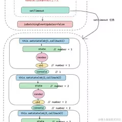

setsate同步异步？
A：因为有一个isbatchedUpdate开关，当我们在原生的异步事件中去使用setState的时候，isbatchedUpdate开关关闭，这个时候不进行批处理，直接同步更新
B：你就像我上面说的那样，只记住了结论，我以前也是这么回答的，但是面试官并不满意，刨根问底的问为什么？其实不是isbatchedUpdate参数控制的，就是setTimeout中的函数推入了原生的事件循环队列，不受react调度，仅此而已。

## 1、强缓存和协商缓存
浏览器缓存是前端性能优化的一个重要点。

强缓存：
Expires - 是具体的一个日期
Cache-Control - max-age=100是以秒为单位
：表示100秒内都使用本地缓存，不向服务器发送请求
表现：状态码：200（from memory/disk cache）

协商缓存/对比缓存/条件请求：
浏览器发送请求到服务器，但是带上缓存验证信息，如果未修改则返回304，修改了就带着修改过的信息返回200
If-Modified-Since ← 对应响应头 Last-Modified
If-None-Match ← 对应响应头 ETag 【浏览器默认优先使用】

no-store 无缓存
no-cache 协商缓存 - 响应头中带了什么 请求头中就带什么 具体用哪个服务器判断的【有两个，两个都带着】
max-age 强缓存

**登陆token失效**
前端发送token -> 后端校验token -> 根据校验结果响应 -> 前端根据响应作出对应跳转或提示。

首先我们第一次登录的时候，我们会获取到。后端返回给我们的一个 token，那我们拿到 token 之后。会通过前端的缓存技术通过 local storage 也好，或者其他缓存技术手段把这个 token 缓存起来。
在发送网络请求的时候，我们会把这个 token 放在请求头上面去发送到服务端。服务端这边不会直接返回数据结果，而是先拿到这个 token 去它数据库里面去匹配一下。看看 token 设置的时效有没有过期。
如果过期了，它就会返回一个像401或者说402那具体是什么状态，就是我们跟后端去协商的哈的这样一个状态。然后我们读取到这个状态之后，我们会前端就会通过路由守卫或者全局拦截器，然后去给他进行一个重业务的一个重定向，让他回到登录页面，这是前端的操作，以及跟后端的一个数据通讯。那么如果后端他那边就是识别到这个 token 还是有效的，它就会直接返回一些正常的一些数据给到我们。
**组件封装**
平常有封装过一些基础的组件，像弹窗按钮这种，也有一些业务类的组件分页器、搜索框。
首先要考虑的就是样式的统一，比如颜色大小间距这些。然后要考虑的就是要暴露出去哪些方法，比如像弹窗的话，会将打开关闭确认取消的方法暴露出去，让外部可以灵活调用。然后设计参数的时候，比如分页器，会加一些默认值，也允许外部传入一些自定义的。然后就是组件内部有一些行为变化的话，比如onchange、onclick这种，需要传递到父组件让父组件感知用户行为。

传参过多如何拆分、复用性的提高-多了解业务逻辑。
**虚拟dom**
就是真实dom的抽象，避免了直接操作dom，虚拟dom优化了真实dom频繁渲染的问题。
jsx通过Babel编译后，就是React.createElement。
一些静态的小变化直接操作dom更快，react中可以用ref直接操作dom。

**diff算法**
比较新dom和旧dom之间的区别，找到最小的更新。不同类型的元素直接销毁，同类型的元素保留dom节点，只更新有变化的属性。react中的列表key，能在diff算法中精确定位，提高了diff的效率。
**fiber架构**
解决了diff算法中阻塞主线程的问题，将diff算法分割成小块任务，可以在适当的时候暂停，而不是一直递归渲染。
**react、vue、angular横向对比**
react整体上来说是一个ui库，强调的是函数式编程和组件化开发，通过状态驱动页面，用虚拟DOM配合diff算法来实现高效渲染，更新视图时是单向数据流。需要自己搭配路由、状态管理之类的，自由度比较高。
Vue是一个渐进式框架，采用了MVVM模式（Model-View-ViewModel），实现了数据的双向绑定，底层使用Object.defineProperty（Vue2）或Proxy（Vue3）做响应式。基于html扩展的模版语法适合快速开发。
angular的话是之前在pwc实习的时候用到过的，angular就是搭建了完整了体系，通过依赖注入管理复杂的关系，也是双向绑定。
**redux**
就是一个集中管理状态的仓库，也可以单独拿来使用，不仅仅是可以在react中用。一个组件改变了sotre中的状态，其他组件也能感知变化，从而间接实现了数据的传递。
**路由**
路由本质上就是一个key-value的映射关系。在 React 中，路由通过监听地址栏变化，不刷新页面，动态渲染组件；Hash模式适配旧浏览器，Browser模式需要服务器支持，现代SPA通常配合BrowserRouter实现更自然的跳转体验。
**组件通信**
父传子-直接通过标签属性传props
子传父-通过父提供的回调函数props传回调
兄弟组件通信-通过父节点当中转或者用redux、context
多层组件传递-usecontext
**hooks：usememo、usecallback、usecontext**
useMemo(fn, deps)：缓存计算值，避免重复计算。
useCallback(fn, deps)：缓存函数引用，避免不必要的子组件重渲染。
useContext(Context)：拿到上下文Context中的数据，代替繁琐的props传递。

**？？？？听webpack大致过程**
从shell命令启动，进行参数合并，
从从这个 shell 语句出发的一个参数合并，再到他 enter 入口编译构建的一个这样的过程，从 model 转换成 loader 去翻译文件，再加上 model 依赖去进行递归的这样的一个处理。最后输出流程，把这每个 model 去组成一个创的这样的文件就是它大致的运行的流程。

**nodejs服务端**
把chrome v8引擎加工成可以在任何操作系统中都能运行js的平台
mogodb记事本 websocket通信 内置模块之类 都有浅浅的敲代码了解过
**es6:promise、微宏同步任务、事件循环、防抖节流、闭包-内存泄露长效缓存、原型链**
>promise：解决回调地狱问题，就是函数不断嵌套的问题，有三个状态pending-初始状态、Fulfilled表示resolve被调用、rejected表示reject被调用，async await是语法糖，看起来像同步一样。
Promise创建是同步的，Promise的后续处理（then/await）是异步的。
同步任务：console.log
异步任务-分宏任务和微任务：
    微任务：promise.then、await
    宏任务-后执行：settimeout、setinterval、
>事件循环：js是单线程的，所以同一时间只能做一件事，事件循环是用来解决如何在单线程上执行多任务的问题的。在js中所有的任务可以分为同步和异步，异步又分为微任务和宏任务，执行顺序是：同步任务立即执行、微任务优先级高于宏任务、宏任务最后按顺序执行
>防抖：只执行最后一次 settimeout cleartimeout，想要更高级功能就多加个参数判断判断【点赞、提交表单】
>节流：一定时间内，无论触发多少次都只执行一次【页面滚动、拖拽】
>原型链：就是每个对象都有一个--proto--属性，它指向的是它上级的一个原型对象，原型对象又会有原型对象，又指向上级的proto，这种循序渐进的过程就是原型链，直到最后null为止
>闭包：就是可以访问其他函数内部变量的函数。闭包延长了数据的生命周期。但是闭包会让外部函数数据无法正常垃圾回收，如果使用太多闭包会导致内存泄露。将变量设置为null释放资源。使用场景：函数柯里化、链式调用等等，不过有时候其实都没意识到产生闭包了。

**性能优化**
1、首屏优化：
让用户更快看到页面，减少白屏时间。
优化方案：减少http请求的次数【多个js、css合并成一个，图片多的话用一大张雪碧图】，一些图片用字体替代【阿里妈妈图标库，把图标制作成字体库】，静态资源上 CDN 分发【将一些静态资源js、css、图片这种上传到cdn服务商】、路由懒加载、适当时候用一些骨架屏

2、虚拟长列表：
一次性只渲染用户能看到的范围。react-window、react-virtualized
监听滚动事件，根据当前滚动位置计算哪些项需要渲染，然后只渲染那些项，关键点就是固定高度和渲染区域。
为了进一步优化性能，我们采用了懒加载和分页的策略。每次只加载当前视口所需的数据，滚动到页面底部时才触发下一页的数据加载。通过这种方式，我们避免了一开始就加载所有数据，减少了页面加载时间，并提高了用户体验。
对于非常大的数据集，我们使用了数据分片的技术。将整个数据集切分为更小的块，每次只加载一小部分数据，避免一次性加载全部数据导致页面卡顿。
