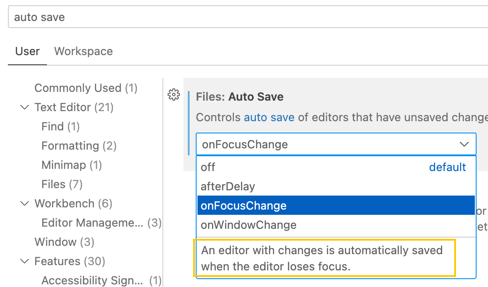
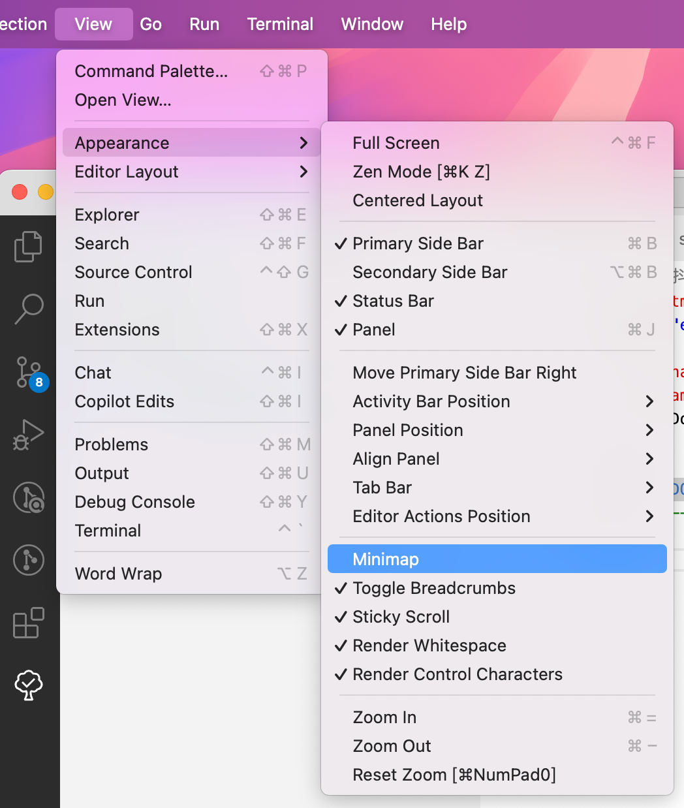

# 这里记录容易忘记的快捷键
删除尾部红空格 - shift + option + t
格式化 - shift + option + f
移动行 - option + 上下
复制整行 - shift + option + 上下
复制整行 直接 cmd + c 到下一行 cmd + v 就行了
合并行 - control + j
回到上一个光标处 - control + -
回到下一个 - control + shift + -
切换文件 - control + tab
左右切换 - option + cmd + 左右键
添加多个光标 键盘 - cmd + option
添加多个光标 - option + 鼠标点点点
添加多个光标的扩展 - option + shift + 鼠标点点点
快速移动光标 - option + 左右 是单词之间快速跳
快速移动光标 - cmd + 左右 是头和尾的跳转

# node_modules文件不自动定位
打开VSCode的setting配置，搜索Auto Reveal Exclude，可以看到自动打开文件/目录的排除配置，把**/node_modules那一项去掉就可以了。

# cmd + ,
快捷打开设置页面

# 修改文件粘贴路径
打开设置页，搜索 markdown.copy，找到Markdown › Copy Files: Destination。
key：```**/*.md```
value【我想将图片放在当前文件夹的images中】：```images/${fileName}```


# 自定义保存
找到VSCode的设置页，搜索 Auto Save，我比较喜欢失焦保存。


# 空文件-空文件 并排显示
找到VSCode的设置页，在设置页面搜索 Compact Folders，把这项勾选掉，就可以了。

# 缩略图


# ts显示类型
找到VSCode的设置页搜索 ```TypeScript › Inlay Hints › Enum Member Values```，选择自己要显示的类型。

# 跳转到上一个光标位置 - ts的时候用到
```control + -```

# 生成目录树
安装插件 project-tree，快捷键 Ctrl+Shift+P 然后输入 Project Tree，查看 README.md 生成好的树。


# 好用插件
## TODO TREE
还有一个类似的叫 TODO Highlight，但是我比较喜欢可以展示在目录里面的哈哈


笨人的设置效果：

配置代码：
```json
  "todo-tree.highlights.defaultHighlight": {
    "type": "text",
    "foreground": "#3478c6",
    "opacity": 0.5,
    "iconColour": "#3478c6",
    "gutterIcon": true
  },
  "todo-tree.general.tags": [
    "ttttdo",
    "mmmmark",
    "bbbbug",
    "mmmmood",
  ],
  "todo-tree.highlights.customHighlight": {
    "ttttdo": {
      "type": "text-and-comment",
      "foreground": "#FF9800",
      "iconColour": "#FF9800",
    },
    "mmmmark": {
      "icon": "unverified",
      "type": "text-and-comment",
      "foreground": "#1ed6c0",
      "iconColour": "#1ed6c0",
    },
    "mmmmood": {
      "icon": "smiley",
      "type": "text-and-comment",
      "foreground": "#41a822",
      "iconColour": "#41a822",
    },
    "bbbbug": {
      "icon": "bug",
      "foreground": "#ff0000",
      "iconColour": "#ff0000",
      "type": "text-and-comment",
    }
  },
```
参考文档：
https://blog.csdn.net/Ztt300/article/details/124474324

## korofileheader
生成代码注释声明的
参考文档：
https://github.com/OBKoro1/koro1FileHeader/wiki/%E5%AE%89%E8%A3%85%E5%92%8C%E5%BF%AB%E9%80%9F%E4%B8%8A%E6%89%8B